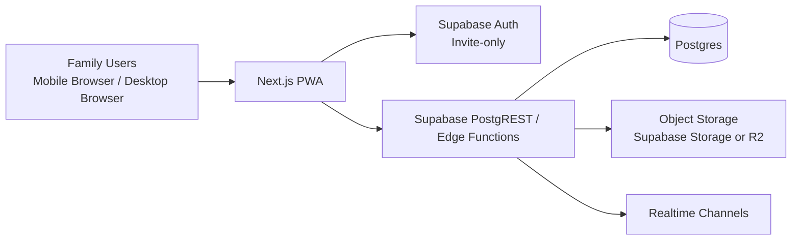

# Recommended Architecture Blueprint (Supabase First)

## 1) High-Level Architecture

## 2) Core Domain Model

### Main entities
- users
- containers (parent-child hierarchy)
- items
- container_members (sharing + role)
- item_photos
- audit_logs

### Suggested SQL tables

#### users
- id (uuid, pk)
- email (text, unique)
- display_name (text)
- created_at (timestamptz)

#### containers
- id (uuid, pk)
- parent_id (uuid, nullable, fk containers.id)
- owner_user_id (uuid, fk users.id)
- name (text)
- location (text)
- tags (text[])
- notes (text)
- status (text default 'enabled')
- created_at, created_by
- updated_at, updated_by
- removed_at, removed_by, removed_reason

#### container_members
- container_id (uuid, fk containers.id)
- user_id (uuid, fk users.id)
- role (text: 'owner'|'editor'|'viewer')
- invited_by (uuid)
- created_at
- primary key (container_id, user_id)

#### items
- id (uuid, pk)
- container_id (uuid, fk containers.id)
- owner_user_id (uuid, fk users.id)
- name (text)
- location (text)
- tags (text[])
- notes (text)
- quantity (numeric)
- unit_cost (numeric)
- priority (text)
- serial_no (text)
- status (text default 'enabled')
- product_mfg_company (text)
- product_seller (text)
- product_buyer (text)
- created_at, created_by
- updated_at, updated_by
- removed_at, removed_by, removed_reason

#### item_photos
- id (uuid, pk)
- item_id (uuid, fk items.id)
- storage_path (text)
- uploaded_by (uuid)
- created_at

#### audit_logs
- id (bigserial, pk)
- entity_type (text: 'container'|'item')
- entity_id (uuid)
- action (text: create/update/remove/share/unshare)
- changed_by (uuid)
- changed_at (timestamptz)
- diff_json (jsonb)

## 3) Cost Computation
- Item total cost = quantity * unit_cost.
- Container computed cost = sum of all descendant item totals.
- Implement with recursive CTE query for on-demand calculation.
- If data grows, add a materialized summary table refreshed on item updates.

## 4) Search Model
- Search scope: only within selected parent container subtree.
- SQL strategy:
  - Store text search vector on name + tags + notes.
  - Use recursive CTE to get descendant container IDs.
  - Filter items/containers by descendant IDs and tsquery.
- Add indexes:
  - items(container_id)
  - containers(parent_id)
  - GIN(tags)
  - GIN(search_vector)

## 5) Access Control and Sharing Rules
- App is invite-only.
- Default sharing role for invited container member: editor (write).
- Owner can downgrade member to viewer.
- User can read/write entities only if:
  - they own the container/item, or
  - they are member of an ancestor container with appropriate role.
- Enforce with Postgres RLS policies.

## 6) API Surface (Example)
- POST /containers
- GET /containers/:id
- POST /containers/:id/share
- POST /containers/:id/unshare
- POST /items
- PATCH /items/:id
- GET /containers/:id/search?q=...
- GET /containers/:id/cost-summary
- POST /items/:id/photos/presign

## 7) UI Strategy
- Build web-first responsive PWA:
  - Works as website.
  - Installable on mobile home screen.
  - Offline draft support for item edits (optional Phase 2).
- Main screens:
  - Container tree + breadcrumb.
  - Item list with quick filters.
  - Item detail with photo gallery.
  - Share management.
  - Change history (audit timeline).
