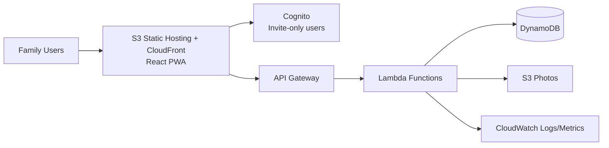

# AWS Reference Architecture (If You Prefer AWS)

## 1) High-Level Architecture

## 2) Service Mapping
- Authentication and invitations: Cognito User Pool + admin invite workflow.
- Authorization: JWT claims + Lambda auth checks for container membership.
- Data:
  - Option 1 (simple): 3 DynamoDB tables (`containers`, `items`, `memberships`).
  - Option 2 (advanced): single-table design for optimized access patterns.
- Photos: S3 with pre-signed URLs.
- Search:
  - Start with DynamoDB indexes and prefix token strategy.
  - Upgrade to OpenSearch only if search complexity grows.

## 3) Pros and Cons Compared to Supabase

Pros:
- Extremely robust cloud foundation.
- Fine control over security and scaling.
- Good if you may productize publicly later.

Cons:
- More engineering overhead to build sharing + query patterns.
- Usually more expensive than near-free alternatives for tiny usage.
- More services to configure and maintain.

## 4) Approx Cost for 4-6 Family Users
- If light usage, still can be low (often single-digit USD/month).
- However, cost unpredictability can come from:
  - CloudFront/S3 egress
  - Lambda invocation spikes
  - DynamoDB on-demand patterns
  - Cognito monthly active users (small for your case)

## 5) Recommendation if Choosing AWS
- Use serverless only (no EC2, no RDS initially).
- Keep architecture minimal: Cognito + API Gateway + Lambda + DynamoDB + S3.
- Add OpenSearch only when native search is insufficient.
